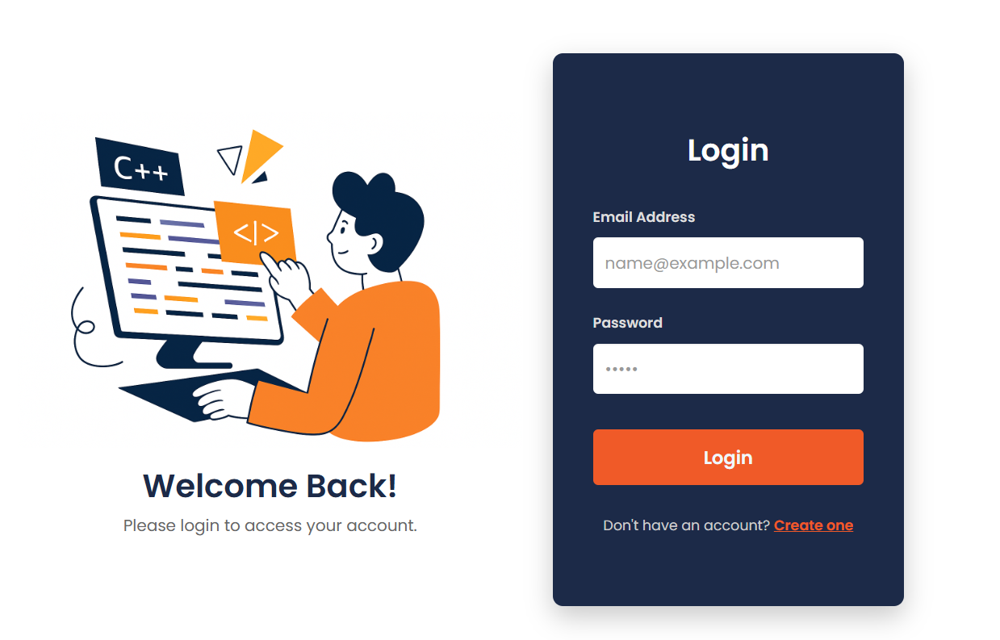
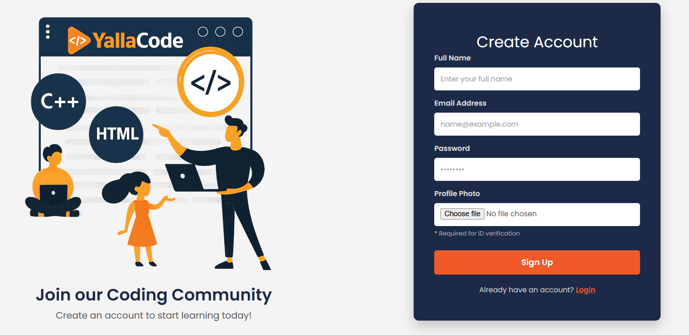
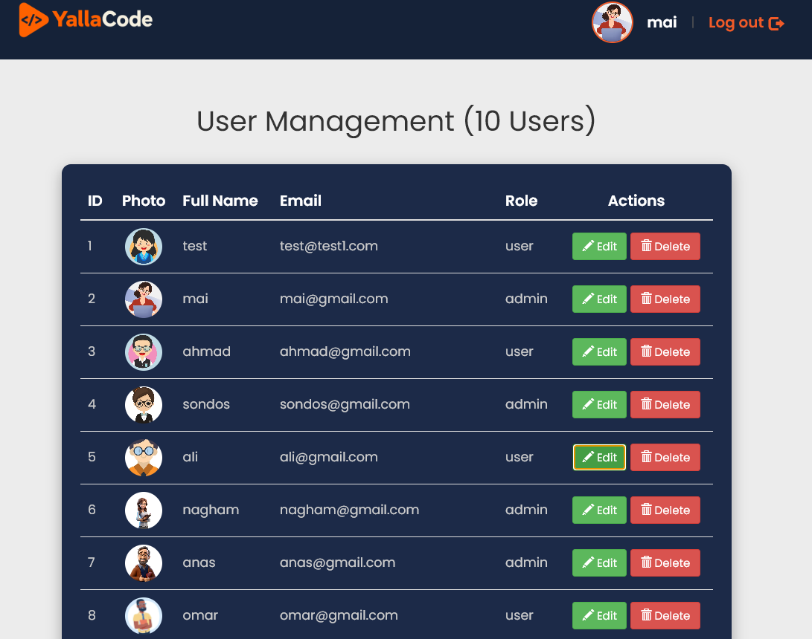

# YallaCode

YallaCode is a PHP and MySQL learning-platform prototype with user authentication, role-based access, profile management, and an administrative dashboard. It provides a responsive course-style interface where visitors can create accounts and signed-in users can browse learning content.

## Screenshots

### Login



### Create Account



### Admin Dashboard

The role-protected dashboard lets administrators view, add, edit, and delete users.



## Features

### User Experience

- Create an account with a name, email, password, and profile image
- Sign in using secure password verification
- Maintain authentication state with PHP sessions
- View a personalized profile page
- Browse responsive course and bootcamp cards
- Sign out and end the active session

### Administration

- Restrict the dashboard to users with the `admin` role
- View all registered users
- Add users with either `user` or `admin` roles
- Edit names, emails, roles, passwords, and profile images
- Delete user accounts
- Display the number of registered users

## Technologies

- PHP 7+
- MySQL
- PDO with prepared statements
- HTML5 and CSS3
- Bootstrap 3 and Bootstrap 5
- JavaScript and jQuery
- Font Awesome
- AppServ, XAMPP, WAMP, or another PHP/MySQL environment

## Application Flow

```text
Visitor
  |-- creates an account --> register_process.php
  |-- signs in -----------> login_process.php
                                |
                                |-- role: user  --> home.php
                                `-- role: admin --> admin.php

Authenticated user
  |-- views profile ------> user_profile.php
  `-- signs out ----------> logout.php

Administrator
  |-- creates users ------> register_process.php
  |-- updates users ------> update_user.php
  `-- deletes users ------> delete_user.php
```

## Security Practices

- Passwords are stored with PHP's `password_hash()`
- Login verification uses `password_verify()`
- Database operations use PDO prepared statements
- Administrative pages validate the session role
- Administrative changes use CSRF tokens and POST requests
- Profile uploads validate file content, type, and size
- Dynamic user content is escaped before HTML output
- Database credentials are kept in an ignored local configuration file
- Uploaded user photos are excluded from the repository

This is an educational project. A production deployment should additionally add rate limiting, email verification, secure cookie settings, and structured application logging.

## Project Structure

```text
YallaCode/
|-- images/                 # Public interface images and branding
|-- screenshots/            # README interface previews
|-- users_images/           # Runtime profile uploads (ignored by Git)
|-- admin.php               # User-management dashboard
|-- createAccount.html      # Registration form
|-- database.php            # Shared PDO connection helper
|-- database.sql            # Database and users-table schema
|-- delete_user.php         # Administrative delete action
|-- home.php                # Main learning-platform page
|-- index.php               # Default application entry point
|-- login.html              # Login form
|-- login_process.php       # Authentication handler
|-- logout.php              # Session logout
|-- register_process.php    # Registration and admin user creation
|-- update_user.php         # Administrative update action
`-- user_profile.php        # Signed-in user profile
```

## Getting Started

### Prerequisites

- PHP 7.3 or later with the PDO MySQL and GD extensions
- MySQL 5.7 or later
- Apache or PHP's development server

### 1. Place the Project

For AppServ:

```text
C:\AppServ\www\YallaCode
```

For XAMPP, place it inside the `htdocs` directory.

### 2. Create the Database

Import [`database.sql`](database.sql) through phpMyAdmin or the MySQL command line:

```bash
mysql -u root -p < database.sql
```

### 3. Configure the Connection

Copy the example configuration:

```bash
copy config.example.php config.php
```

Update `config.php` with the local MySQL database name, username, and password. The file is excluded from Git to prevent credentials from being published.

### 4. Prepare Profile Uploads

Make sure the web server can write to:

```text
users_images/
```

### 5. Run the Application

Start Apache and MySQL, then open:

```text
http://localhost/YallaCode/
```

AppServ 9.3 includes the required Apache, PHP, and MySQL services. AppServ itself is not part of the project and should not be committed to GitHub.

The default AppServ upload limit is usually 2 MB. YallaCode uses the same limit for profile images. If the PHP setting is changed, update both `upload_max_filesize` in `php.ini` and the limit in `security.php`.

AppServ 9.3 commonly uses `AllowOverride None`, so `.htaccess` rules may be disabled. The included `users_images/index.php` still blocks directory listings. To enable the additional `.htaccess` protection, change the `C:/AppServ/www` directory setting in Apache's `httpd.conf` to `AllowOverride All`, then restart Apache.

## Creating an Administrator

1. Register a normal account through the application.
2. Promote it using phpMyAdmin or MySQL:

```sql
UPDATE users
SET role = 'admin'
WHERE email = 'your-email@example.com';
```

3. Sign in again to open the administrative dashboard.

## Database Model

The application uses one `users` table:

| Column | Purpose |
| --- | --- |
| `id` | Unique user identifier |
| `fullname` | Display name |
| `email` | Unique login email |
| `password` | Secure password hash |
| `photo` | Uploaded profile-image filename |
| `role` | Access level: `user` or `admin` |
| `created_at` | Account creation timestamp |

## Author

Created as a PHP and MySQL web-development project.
